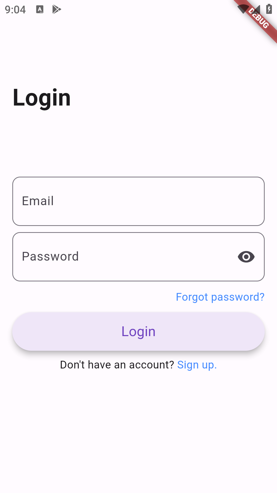
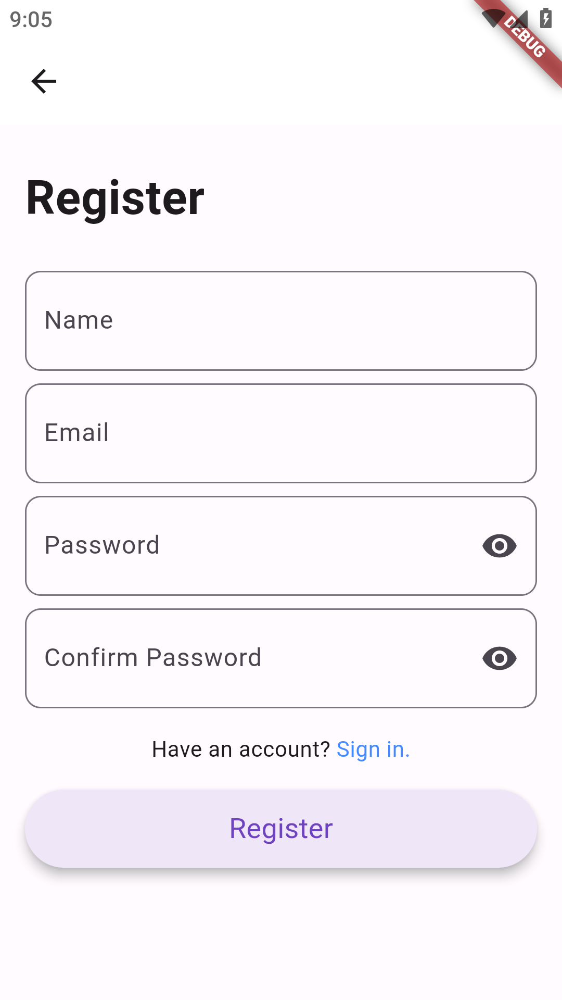
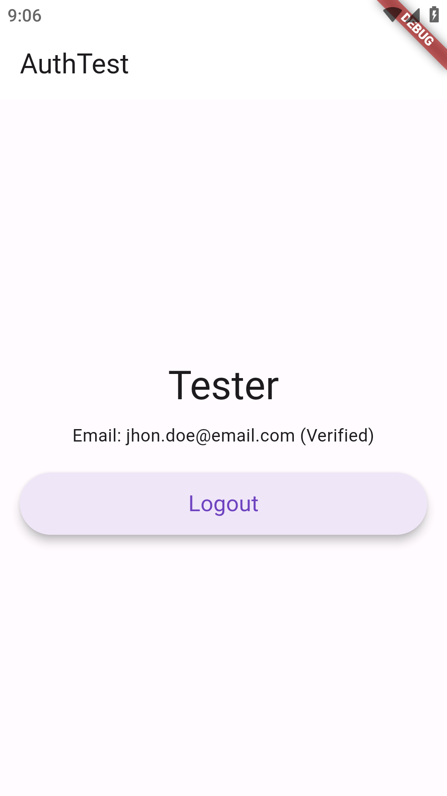

    <h1>Auth Test</h1>
    
An Multiplatform app for simple authentication.

---

  
  
   
  
  

## Features
- Login
- Register
- Change Password
- Detail User

## Tech Stack & Library
- [Firebase Auth](https://pub.dev/packages/firebase_auth) for authentication.
- [Firestore](https://pub.dev/packages/cloud_firestore) for database.
- [BLoC](https://pub.dev/packages/bloc) for state management.
- [Form Builder](https://pub.dev/packages/flutter_form_builder) for form validation.
- [Dart Mappable](https://pub.dev/packages/dart_mappable) for mapping data.
- [Logger](https://pub.dev/packages/logger) for logging.
- [Injection](https://pub.dev/packages/injectable) with [GetIt](https://pub.dev/packages/get_it) for dependency injection.
- Used AndroidX, Jetpack Compose, Material Design Components 3, ViewModel, and any more libraries

## Data Source
Auth test app using [Firebase](https://firebase.google.com/) via [FlutterFire](https://firebase.google.com/docs/flutter/setup).
